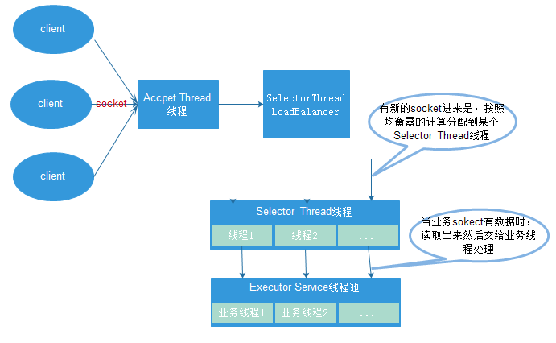

1. 主要讲一下几种服务模型

   - 阻塞服务

     - TSimpleServer
       - 单线程，阻塞，一次只能处理和接收一个socket
     - TThreadPoolServer
       - 多线程，阻塞，同时处理socket数取决于线程数
       - 类似Executors.newCachedThreadPool可伸缩（有上下限），线程池采用SynchronousQueue队列
       - 区分监听线程和工作线程。监听线程负责接收，工作线程负责业务逻辑。
       - 适合请求量固定的场景

   - 非阻塞服务-均采用事件驱动/多路复用

     - TNoneBlockingServer

       - 非阻塞，单线程selector轮询。
       - 如果某个工作线程处理慢，会影响整体响应

     - THsHaServer(half-sync/half-async)

       - TNoneBlockingServer的优化，业务处理过程交给线程池，主线程接收完直接返回进行下一次循环
       - half-sync/half-async：半异步半同步。对io事件异步，对handler的rpc请求同步
       - 并发大的时候，主线程可能忙着处理响应，不一定能及时接收到新的socket请求

     - TThreadSelectorServer

       - 用得最多，稍微复杂一点，不过也很好理解。简单来说就是将接收/分配/读写区分不同线程池。

       - 1个AcceptThread专门负责socket新连接

       - N个SelectorThread负责IO读写

       - 1个负载均衡器，负责协调AcceptThread与SelectorThread

       - 1个ExecutorService工作线程池(Executors.newFixedThreadPool)，负责执行业务逻辑线程管理

       - 具体流程可参考这张图

         

