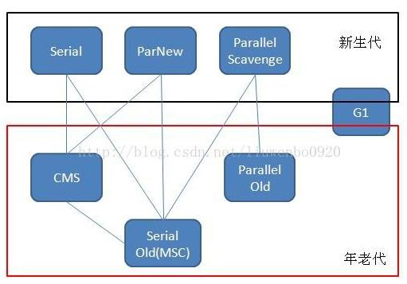

1. 堆划分（ * num 为比例，大致的，不一定完全是）

   - 1.7及以前，young(eden * 8, from * 1, to * 1) * 1, old * 2, permgen * x
   - 1.8及以后，young(eden * 8, from * 1, to * 1) * 1, old * 2, metaspace
     - 1.7也有metaspace，只不过只存部分数据，1.8开始将permgen的数据全部放到metaspace
     - metaspace大小默认不受jvm参数控制，直接受机器内存影响

2. 各代作用

   - eden
     - 对象初创存放点（对象过大会直接丢到old），内存不够会触发minorGC
   - from
     - 数据来自上一轮minorGC的to，存放上一代幸存者。对象初创也可能存放在这里。本轮minorGC后会将from转移到to。
   - to
     - 数据来自本轮minorGC的from和eden存活对象，且年龄+1，超过年龄（默认15）的丢old，装不下的也丢old。本轮minorGC后会清空eden和from。每次minorGC后会跟from翻转角色
   - old
     - 存放大对象和young过来的对象。内存不足或者新建较大对象分不出那么多内存时触发majorGC(即fullGC)，装不下时导致OOM
   - permgen
     - 存放类加载和meta，常量池。
     - fullGC才会清理。
   - metaspace
     - 1.7存放meta，1.8存放类加载和meta、常量池
     - gc时主要回收废弃的常量和无用类
     - fullGC才会清理。

3. gc

   - 确定是垃圾的方法

     - 引用计数法
     - 可达性分析GC roots

   - 算法

     - 标记清除(mark-sweep)
       - 内存碎片化严重
     - 复制算法
       - 标记清除的优化，内存分开两半，一半(part a)用来使用，另一半(part b)用来复制存活对象。回收时将存活的对象放入part b，再清空part a。实现简单但是内存利用率不高，且存活对象多时效率不高。
     - 标记整理(mark compact)
       - 对复制和标记清除的优化。将标记的存活对象移到内存的一端，再将另一端非存活对象清理掉。
     - 分代收集
       - 针对各代对象不同的特性使用不同算法
         - young因为短命对象占比大，因此使用复制算法
         - old每次只回收少量对象，使用标记整理算法
     - 分区收集算法
       - 将堆空间划分若干个小空间，控制好每次gc回收的空间数。这样可以避免一次回收太大量导致停顿时间长。

   - java引用类型

     - 强引用
       - 正常代码的引用变量赋值都是强引用
     - 软引用
       - 内存足够时就不会被回收，内存敏感的程序中会用到。需要继承SoftReference。
     - 弱引用
       - 只要执行GC就会被回收。需要继承WeakReference。
     - 虚引用
       - 不能单独使用，必须和引用队列联合使用，用于跟踪对象被垃圾回收的状态。需要继承PhantomReference。

   - 垃圾收集器

     - Serial垃圾收集器

       - 单线程，使用复制算法。
       - 执行时暂停其他所有工作线程，即stw(stop-the-world)，直到完成。
       - 没有线程切换开销，效率高。
       - jdk1.3.1之前新生代唯一的收集器。
       - JVM在Client模式下默认的young收集器。

     - ParNew垃圾收集器（Serial+多线程）

       - Serial的多线程版本，线程数默认与CPU数目相同，算法也是复制算法。
       - 执行时也会暂停其他所有工作线程。
       - 多数JVM在Server模式下默认的的young收集器。

     - Parallel Scavenge收集器

       - young收集器，多线程，复制算法，关注吞吐量
         - 吞吐量=工作线程CPU使用时间/(工作线程CPU使用时间+GC时间)
       - 适用于后台运算，交互不多的任务。
       - 与ParNew最重要的区别是自适应调节策略
         - java8默认UseParallelGC，young默认使用Parallel Scavenge开启自适应调节策略，因此young的三个区比例不一定是8:1:1

     - Serial Old收集器

       - 单线程，标记整理算法
       - JVM在Client模式下默认的old收集器
       - 在Server模式下有两个用途
         - JDK1.5之前与young的Parallel Scavenge收集器搭配使用
         - 作为old使用CMS收集器的后备垃圾收集方案

     - Parallel Old收集器

       - 多线程，标记整理算法，Parallel Scavenge的old版本
       - JDK1.6开始提供使用
       - 对吞吐量要求比较高可以考虑Parallel Scavenge+Parallel Old搭配使用

     - CMS收集器（多线程标记清除算法）

       - CMS：Concurrent mark sweep，多线程标记清除，old收集器
       - 主要目标是获取最短垃圾回收挺短时间，适合重交互的程序
       - 执行步骤如下
         1. 初始标记。标记GC Roots能关联的对象，速度快，会stw
         2. 并发标记。进行GC Roots跟踪过程，不会stw
         3. 重新标记。修正标记，调整上一步并发时其他线程可能会操作到的对象的标记，速度快，会stw
         4. 清除标记。清除GC Roots不可达对象，不会stw
       - 耗时间长的并发标记和清除标记两个步骤是跟用户线程一起执行的，所以说stw时间相对最短，对交互的影响也最小。

     - G1收集器

       - CMS的优化版。
       - 基于标记-整理，而不是标记清除。
       - 可以精确控制stw时间，在不牺牲吞吐量前提下，实现低停顿垃圾回收。
       - 实现原理
         - 堆内存划分几个固定大小的独立区域，避免全区域收集，跟踪收集进度
         - 维护优先级列表，优先回收垃圾最多的区域

     - 各收集器使用场景如下(Hotspot JDK1.6)

       

4. JVM类加载机制

   - 过程/生命周期
     1. 加载。在内存中生成一个代表这个类的java.lang.Class对象，作为方法区入口

        - 可以从class文件、jar/war包、运行时（动态代理）、JSP等途径获取/读取

     2. 验证。校验Class文件的字节流符合虚拟机要求与安全性

     3. 准备。设置初始值，和在方法区分配初始变量的内存。

        ```java
        public static int v1 = 80;//准备阶段 v1=0
        public static final int v2 = 80;//准备阶段 v2=80
        ```

     4. 解析。将常量池的符号引用替换为直接引用。

        - 符号引用：不一定要加载到内存中，可能只是class文件。各虚拟机布局实现可能不同
        - 直接引用：可以指向目标指针，已经加载到内存中。

     5. 初始化

        - 除了在加载过程可以选类加载器外，其余操作都由jvm主导
        - 到这个阶段才真正执行类定义的Java代码
        - 是执行类构造器\<client\>方法的过程
          - client方法总是优先执行父类的
          - 如果没有静态块/静态变量赋值，编译器可以不生成client方法
        - 不会执行类初始化的几种情况
          - 通过子类引用父类的静态字段，子类不会初始化
          - 定义对象数组
          - 类有常量，但是没有被引用过
          - 通过类名获取Class对象
          - Class.forName加载，initialize为false时
          - 通过ClassLoader的默认loadClass方法

     6. 使用、卸载。这两点好理解，不做说明。

   - 类加载器

     - 双亲委派模型

       - 类加载器收到加载请求时，总会尝试通过父类加载器完成。如果父类加载器抛出ClassNotFoundException，才会尝试自己加载。
         - *应用程序的jar包导入不属于双亲委派范围，都是应用层面的类加载
       - 流程

       

       

       

     - 线程上下文类加载器ThreadContextClassLoader

       - 主要参考[这篇文章](https://blog.csdn.net/yangcheng33/article/details/52631940)

       - SPI(Service Provider Interface)
         - 定义好接口，让各厂商自己去实现，只需要按要求在指定位置存放实现代码和配置即可
         - ClassLoader是没法加载的，但是可以加载到当前执行线程的TCCL（即ThreadContextClassLoader，线程上下文类加载器）里，可以在实现类里的static块做自己想要的操作
         - 
       - 适用场景
         - 高层提供统一接口让低层去实现，又要在高层加载或实例化低层的类，该加载器可以帮助找到并加载此类
         - 隔离不同调用者（可以研究一下spring、tomcat）

     - 

5. OSGi-略过

