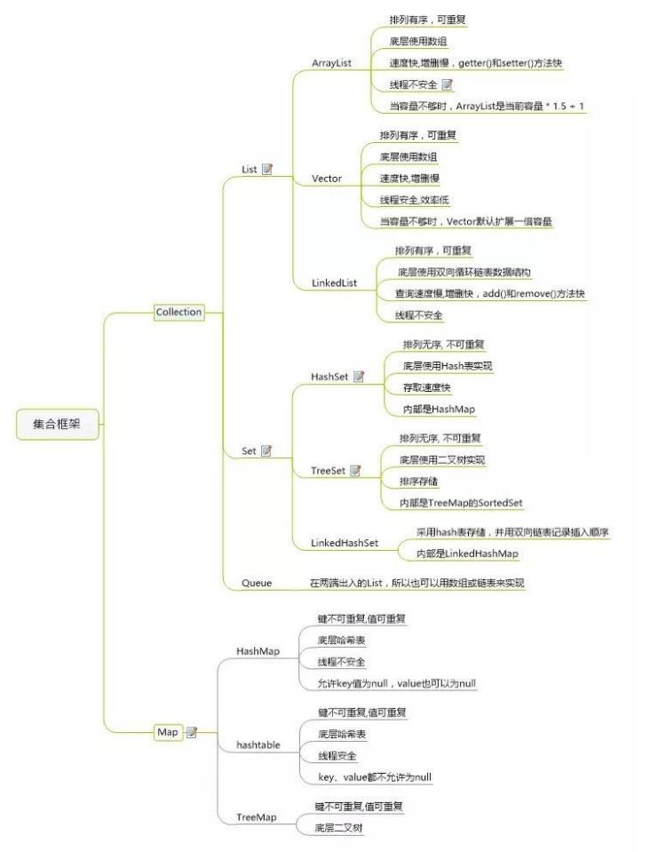

###### 概况

###### Map

- HashMap

  - 扩展因子0.75，大于时扩一倍容量。初始默认16，如果初始指定非2^n，则会自动往上扩充到2^n

  - 1.7-数组+链表实现，1.8当链表长度超过8时，改红黑树
  - 1.7的put(null,x)默认放在data[0]
  - 1.7是先扩容后插入新值的，1.8先插值再扩容
  - Collection.synchronizedMap只是在各个方法上加上synchronized关键字而已，本质还是HashMap

- ConcurrentHashMap

  - 1.7
    - 其实就是HashMap基础上加多个Segments数组外壳（Segment内部与HashMap实现稍有不同），Segment继承自ReentrantLock，Segment个数即并发量，默认16，不可扩容，默认初始化Segment[0]
    - 通过计算key的hash，再通过类似掩码计算，确定放哪个Segment
    - 通过while循环尝试获取所在Segment的锁，超过一定次数（单核1多核64）放阻塞队列去等
    - 通过UNSAFE和volatile保证读写并发的安全性
  - 1.8
    - 还是数组，取消了segment分段锁概念，计算hash，确定放到哪个位置
    - 如果位置为null，cas方式put数据
    - 如果非null
      - 首个节点（链表/红黑树）的hash= -1
        - 正在扩容，参与到扩容
      - 首个节点（链表/红黑树）的hash != -1
        - synchronized锁住首个节点
        - 插入

###### List

- CopyOnWriteArrayList
  - 只有增删操作加锁
  - 内部持有一个数组
  - 增删加了个ReentrantLock
  - 增加时必定复制当前数组，并把元素塞最后
    - 指java.util.concurrent.CopyOnWriteArrayList#add(E)方法，其他重载方法类似，无非就是copy多个数组。
  - 删除时如果是最后一个位置，直接将数组长度-1，否则还是拼接数组
    -  指java.util.concurrent.CopyOnWriteArrayList#remove(int)方法，其他重载方法类似。

###### Set

- CopyOnWriteArraySet
  - 只有增删操作加锁
  - 其实内部就是个CopyOnWriteArrayList，各种方法也只是简单封装。
  - add调用addIfAbsent，先检查再add

