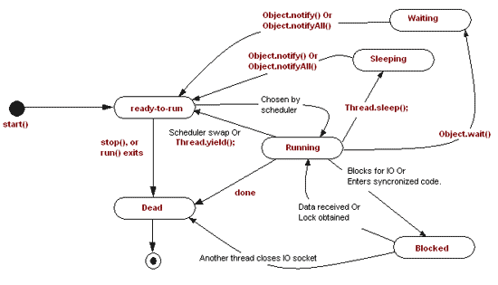
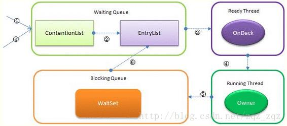

1. 自带线程池中，newCachedThreadPool用的线程池阻塞队列是SynchronousQuene，一种不存数据的阻塞队列，必须要有人取出了才能继续写入。其余线程池中，newFixedThreadPool用LinkedBlockingQueue，newScheduledThreadPool用的是DelayedWorkQueue。

2. 线程的一些操作基本释义 

   - 引用[stackOverflow](https://stackoverflow.com/questions/9700871/what-is-difference-between-sleep-method-and-yield-method-of-multi-threading)的一张图

     

3. 锁

   - 偏向锁

     - 简单理解就是如果当前线程获取到了锁，再进入时不再执行同步块操作，直接执行
     - 单线程或小竞争下同步块的效率会大大提高
     - 多并发时一样惨不忍睹，甚至会因为锁竞争频繁上下文切换导致效率更低

   - 轻量级锁

     - 偏向锁失败时默认申请轻量级锁
     - 虚拟机内部实现
     - 锁住对象头的指针
     - 只需要判断该对象头的指针是否在锁的范围内即可

   - 重量级锁

     - 轻量级锁获取失败时申请重量级锁
     - 操作过程中可能会被操作系统层面挂起，效率低，切换成本高

   - 自旋锁

     - 获取不到锁时，执行空循环
     - 循环一定次数之后还没拿到才挂起阻塞
     - 减少了上下文切换，但是加大了cpu负荷，同步块执行时间长的话cpu负荷很大
     - 1.5只能使用默认配置，1.6可配置等待次数，1.7之后内部自动调整

   - synchronized原理

     - 所有竞争线程都丢到ContentionList（其实是链表），Owner释放锁的时候会将一部分ContentionList线程移动到EntryList。
     - 有资格成为候选的线程从ContentionList丢到EntryList，Owner释放锁的时候会将EntryList的尾部提拔为OnDeck。
     - 获取到锁的线程调用wait之后丢到WaitSet，调用notify或者notifyAll后返回EntryList。
     - 任意时刻最多只有一个线程在竞争锁资源，该线程被称为OnDeck。
     - 获取到锁资源的线程被称为Owner。
     - 已释放锁的线程被称为!Owner。
     - 所有线程进来之后会先跟OnDeck竞争锁，竞争不过才丢到ContentionList（其实就是自旋锁过程），竞争到了，则是将OnDeck丢回EntryList（这不公平）。

     

     - 如果对象存在多个synchronized方法，实际上每次执行锁住的是整个对象，所以所有的synchronized都会阻塞

4. CountDownLatch、CyclicBarrier和Semaphore

   - CountDownLatch（闭锁）
     - 主线程等其他线程执行完再往下执行，不可重复使用。
     - 原理：主线程不停循环，直到计数器为0；其他线程执行完计数器-1。
     - 内部持有一个aqs实现的Sync
   - CyclicBarrier
     - 一组线程达到互相等待直到所有线程达到某个点之后各自再往下执行，可重复使用。
     - 原理：内部持有一个ReentrantLock和Condition
   - Semaphore
     - 指定同时只能有x个线程执行某段代码
     - 内部持有一个aqs实现的Sync

5. volatile

   - 禁止指令重排
   - 永远都读主存的值，但是不保证绝对的新值
   - 适合单纯赋值操作，比如i++，或者i=1

6. ThreadLocal

   - 功能不赘述了，简单提一下内部实现。线程本身带有一个ThreadLocalMap，get的时候先获取当前线程的ThreadLocalMap，这个map里Entry对象继承自WeakReference，key为当前ThreadLocal对象，value为存储内容。

7. CAS(check and swap)

   - ABA的问题

     - 这里的check获取到的值可能已经被修改过，只不过又改回来了。
     - 一些乐观锁的解决方案是，带上版本号，版本号不会重复，并且处理完会+1，不合要求就当失败。

   - AQS(AbstractQueuedSynchronizer，抽象队列同步器)

     - 基础原理

       - 内部维护一个volatile int state和一个FIFO线程等待队列（双向，其实就是链表，head为占用线程，其余为等待线程）

       - 以ReentrantLock的非公平锁为例窥探一下aqs基本流程。

         - 尝试一次CAS，成功了直接执行，设置当前owner为当前线程

         - 不成功的，执行以下操作

           - 如果有资源，再尝试一次CAS。成功了直接执行，设置当前owner为当前线程

           - 如果已经是owner线程，标记state=state+1，正常执行

           - 上两步没有获取到资源，入队列尾部

           - 无限循环。如果队列里前一个线程是头部，再次尝试CAS，否则根据waitStatus判断是跳过前一个node还是阻塞，或者中断。waitStatus如下：

             - CANCELLED = 1：线程已被取消，如果pre是这个状态，跳过
             - SIGNAL = -1：如果pre是这个状态，当前node阻塞起来(park);
             - CONDITION = -2 :线程(处在Condition休眠状态)在等待Condition唤醒;
             - PROPAGATE = –3:(共享锁)其它线程获取到“共享锁”.

           - 执行完unlock时，会清理掉owner并唤醒下一个node的线程

             - 自身重复申请可直接state+1获得锁，但是会state+1，感觉就是偏向锁的原理，但是不明白这个设计合理性何在。
             - 所以不好控制的话不要手贱lock多次就对了

           - 引用[ifeve文章](http://ifeve.com/introduce-abstractqueuedsynchronizer/)，伪代码可以这样写

             ```java
             //获取
             while(获取锁) {
             	if (获取到) {
             		退出while循环
             	} else {
             		if(当前线程没有入队列) {
             			那么入队列
             		}
             		阻塞当前线程
             	}
             }
             //释放
             if (释放成功) {
             	删除头结点
             	激活原头结点的后继节点
             }
             ```

             

       - 通过CAS竞争资源。

         - 比如ReentrantLock，初始state = 0，获取到资源+1，释放时置0
         - 又如CountDownLatch，初始state =N ，子线程执行完-1，主线程getState=0时往下执行

       - 队列里会不停尝试

         - 公平锁：进队列，严格按照FIFO执行
         - 非公平锁：新来的直接跟队列前排线程竞争，争到了就执行，争不到就进队列
         - 非公平锁显然跟synchronized实现原理大致相同

     - 独占锁与共享锁

       - 独占锁经典实现：ReentrantLock
       - 共享锁经典实现：Semaphore、CountDownLatch

     - 

8. 


